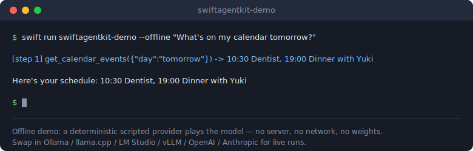
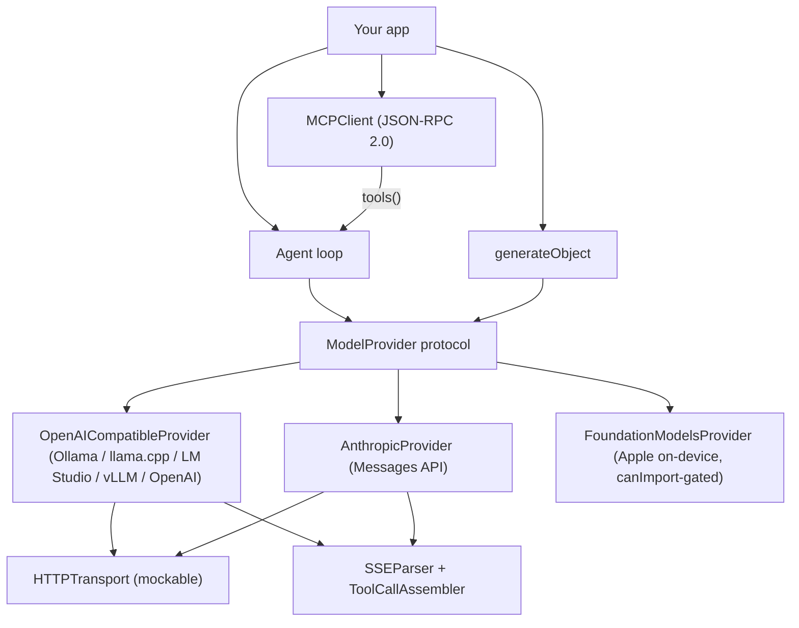

# SwiftAgentKit

[English](README.md) | [中文](README.zh.md) | [日本語](README.ja.md)

[](LICENSE) 

**Swift 製のオープンソース LLM ミドルウェア。tool calling・structured output・streaming・MCP を、ローカルモデルとクラウドモデルの両方で利用できます。**



```swift
// まだタグ付けされていません — https://github.com/JaydenCJ/swift-agent-kit を
// クローンしてローカルパッケージとして追加してください:
.package(path: "../swift-agent-kit")
```

## なぜ SwiftAgentKit なのか

Python には LangChain が、TypeScript には Vercel AI SDK がありますが、LLM を組み込む Swift アプリは今も tool calling の JSON、response format の schema、SSE パース、リトライ処理を手書きし、バックエンドを替えるたびに書き直しています。推論レイヤーはすでに揃っています（Foundation Models、Ollama 経由で配信される MLX、llama.cpp）。欠けていたのは、アプリとランタイムの間のミドルウェアです。SwiftAgentKit はその層を埋めます。推論そのものは行わず、ひとつのプロトコルで任意のバックエンドをアプリのコードへつなぎます。

|  | SwiftAgentKit | swift-transformers | LLM.swift |
|---|---|---|---|
| Tool calling | Yes — schema inferred from `Codable` | No | No |
| Structured output | Yes — JSON Schema `response_format` | No | No |
| MCP client | Yes — JSON-RPC 2.0 over stdio | Named as a 1.0 roadmap gap | No |
| クラウドとローカルを 1 つの API で | Yes — OpenAI-compatible, Anthropic, Foundation Models | No — local Core ML / Hub | No — local llama.cpp |
| 推論エンジンの内蔵 | No — glue layer by design | Yes — Core ML | Yes — llama.cpp |

## 特徴

- **ひとつのプロトコルであらゆるバックエンドへ** — `ModelProvider` が generate と stream の両方を抽象化します。同じアプリコードが機内モードでは Ollama、本番ではクラウド API で動きます。プリセットは Ollama・llama.cpp `llama-server`・LM Studio・vLLM・OpenAI をカバーし、その他の OpenAI 互換サーバーは base URL の指定だけで使えます。
- **schema のボイラープレートなし** — `Tool.typed { (input: MyStruct) in … }` が、プロービングデコーダーで `Codable` 型から JSON Schema を自動推論します。マクロも独自 DSL も不要です。
- **型付きの結果** — `generateObject(Recipe.self, provider: p, prompt: "…")` が JSON Schema 形式の response format を送信し、デコード済みの `Recipe` を返します。Markdown フェンスや散文混じりの JSON にも耐性があります。
- **ループを書かなくてよい** — `Agent` が tool call を並列実行し（結果は呼び出し順を維持）、ツールのエラーはアプリに投げずにモデルへフィードバックし、ステップごとの記録、トークン使用量の集計、`maxSteps` による上限管理を行います。
- **実ネットワークに耐える streaming** — WHATWG 準拠のインクリメンタル SSE パーサーを備えています。チャンク境界が行の途中・JSON の途中・マルチバイト UTF-8 文字の内部に落ちても、日本語や絵文字は壊れずに届きます。
- **MCP は 1 行で** — `MCPClient` が stdio（またはカスタムトランスポート）上で JSON-RPC 2.0 を話します。`try await client.tools()` で任意の MCP サーバーのツールを `Agent` に渡せます。
- **依存ゼロ・モデル非同梱** — Foundation のみに依存するピュア Swift で、Swift 6 の strict concurrency でビルドされます。コアは Linux でもビルド・テスト可能です。モデルサーバーや API key は利用者が用意し、外部への送信は一切ありません。

## クイックスタート

**1.** `Package.swift` に依存を追加します（Swift 6.0+ / Xcode 16.2+。iOS 16、macOS 13、または Linux）:

```swift
// まだタグ付けされていません — https://github.com/JaydenCJ/swift-agent-kit を
// クローンしてローカルパッケージとして追加してください:
.package(path: "../swift-agent-kit")
```

**2.** provider を選びます。SwiftAgentKit はモデルの重みを同梱しません。自前のサーバー（Ollama、llama.cpp、LM Studio、vLLM、任意の OpenAI 互換 endpoint）またはクラウド API を指定してください:

```swift
let provider = OpenAICompatibleProvider.ollama(model: "qwen3")
```

**3.** モデルにツールを渡して agent を実行します。以下のスニペットはテスト（`ReadmeExampleTests`）がそのままカバーしています:

```swift
struct CalendarQuery: Codable { var day: String }
let calendar = try Tool.typed(
    name: "get_calendar_events",
    description: "Return the calendar events for a day ('today' or 'tomorrow')."
) { (query: CalendarQuery) in
    query.day == "tomorrow" ? "10:30 Dentist, 19:00 Dinner with Yuki" : "No events."
}
let agent = Agent(provider: provider, tools: [calendar])
let answer = try await agent.run("What's on my calendar tomorrow?")
print(answer.text)
```

**4.** 手元にモデルがない場合は、同梱のオフライン demo を実行してください（Swift 6.0+ toolchain が必要です。スクリプト化された provider がモデルの役を務めるため、サーバーもネットワークもダウンロードも不要で、出力は決定的です）:

```bash
git clone https://github.com/JaydenCJ/swift-agent-kit.git && cd swift-agent-kit
swift run swiftagentkit-demo --offline "What's on my calendar tomorrow?"
```

出力:

```text
[step 1] get_calendar_events({"day":"tomorrow"}) -> 10:30 Dentist, 19:00 Dinner with Yuki

Here's your schedule: 10:30 Dentist, 19:00 Dinner with Yuki
```

環境変数 `SAK_BASE_URL`・`SAK_MODEL`・`SAK_API_KEY` を設定すると、同じ demo を任意の OpenAI 互換 endpoint に向けられます。

## アーキテクチャ

SwiftAgentKit は意図的にグルーレイヤーに徹しています。推論は行わず、サードパーティ依存はゼロ、Apple 専用フレームワークは `#if canImport` で隔離しています。



知っておきたい設計判断は次の 3 つです。

- **`JSONValue` を全域で使用。** ツール引数、schema、wire ペイロード、MCP メッセージが 1 つの `Sendable` JSON モデルを共有し、キーをソートした決定的なシリアライズを行います。リクエストボディがバイト単位で安定するため、provider の prompt cache が効き続けます。
- **マクロなしの schema 推論。** `JSONSchema.infer(from:)` は、型が合成した `Decodable` 実装をプロービングデコーダー上で実行します。Optional は非必須プロパティに、`CaseIterable` な文字列 enum は `enum` schema に、`Date`/`URL`/`UUID` は文字列 format に対応します。
- **トランスポートは注入式。** provider は `HTTPTransport` を受け取るため、テストスイートはリクエスト/ストリームのパイプライン全体を mock で駆動でき、アプリはリトライ・ログ・certificate pinning を差し込めます。

## ロードマップ

> **正直な注記:** v0.1.0 は公式 Swift コンテナで検証済みです（`docker run --rm -v $PWD:/src -w /src mirror.gcr.io/library/swift:latest swift test`、Swift 6.3.3 / x86_64 Linux）：127 個のテストがすべて成功、0 失敗 0 警告、`scripts/smoke.sh` は `SMOKE OK` で完了します。macOS/Xcode ビルド（Foundation Models 経路を含む）と実機での挙動は未検証のままです。

- [x] `ModelProvider` プロトコル: generate + stream
- [x] OpenAI 互換 provider（Ollama / llama.cpp / LM Studio / vLLM / OpenAI）
- [x] Anthropic Messages provider とネイティブ SSE デコード
- [x] 型付き入力の tool calling と schema 推論
- [x] structured output（`generateObject`）と寛容な JSON 抽出
- [x] Agent ループ: 並列ツール実行、エラーフィードバック、ステップ記録、使用量集計
- [x] MCP client: stdio transport、ハンドシェイク、tools/list、tools/call、ツールブリッジ
- [ ] Foundation Models: 動的ツールブリッジと `@Generable` 連携
- [ ] MCP: Streamable HTTP transport、resources と prompts
- [ ] ネイティブ MLX provider（`mlx-swift` 直結、サーバー経由なし）
- [ ] ストリーミング agent ループ（`agent.stream(_:)`、ツールイベントのライブ配信）
- [ ] OpenAI Responses API 対応

全体は [open issues](https://github.com/JaydenCJ/swift-agent-kit/issues) を参照してください。

## コントリビューション

コントリビューションを歓迎します。まずは [good first issue](https://github.com/JaydenCJ/swift-agent-kit/issues?q=is%3Aissue+is%3Aopen+label%3A%22good+first+issue%22) から、または [Discussions](https://github.com/JaydenCJ/swift-agent-kit/discussions) でお気軽にどうぞ。開発環境と基本ルールは [CONTRIBUTING.md](CONTRIBUTING.md) にあります。

## ライセンス

[MIT](LICENSE)
