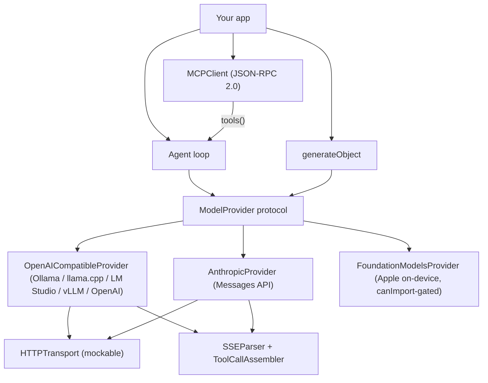

# SwiftAgentKit

[English](README.md) | [中文](README.zh.md) | [日本語](README.ja.md)

[](LICENSE) 

**Open-source LLM middleware in Swift — tool calling, structured output, streaming and MCP for local and cloud models.**


```swift
// Not yet tagged — clone https://github.com/JaydenCJ/swift-agent-kit
// and add it as a local package:
.package(path: "../swift-agent-kit")
```

## Why SwiftAgentKit?

Python has LangChain and TypeScript has the Vercel AI SDK, but a Swift app that talks to an LLM still hand-rolls its own tool-calling JSON, response-format schemas, SSE parsing and retry plumbing — and then rewrites all of it for the next backend. The inference layer is already in good shape (Foundation Models, MLX served through Ollama, llama.cpp); what has been missing is the middleware between your app and those runtimes. SwiftAgentKit is that layer: it runs no inference itself and glues any backend to your application code through one protocol.

|  | SwiftAgentKit | swift-transformers | LLM.swift |
|---|---|---|---|
| Tool calling | Yes — schema inferred from `Codable` | No | No |
| Structured output | Yes — JSON Schema `response_format` | No | No |
| MCP client | Yes — JSON-RPC 2.0 over stdio | Named as a 1.0 roadmap gap | No |
| Cloud + local behind one API | Yes — OpenAI-compatible, Anthropic, Foundation Models | No — local Core ML / Hub | No — local llama.cpp |
| Runs inference itself | No — glue layer by design | Yes — Core ML | Yes — llama.cpp |

## Features

- **One protocol, every backend** — `ModelProvider` abstracts generate *and* stream. The same app code runs against Ollama in airplane mode and a cloud API in production; presets cover Ollama, llama.cpp `llama-server`, LM Studio, vLLM and OpenAI, and any other OpenAI-compatible server takes one base URL.
- **Zero schema boilerplate** — `Tool.typed { (input: MyStruct) in … }` infers the JSON Schema from your `Codable` type with a probing decoder. No macros, no schema DSL.
- **Typed results** — `generateObject(Recipe.self, provider: p, prompt: "…")` sends a JSON-Schema response format and returns a decoded `Recipe`, surviving markdown fences and prose-wrapped JSON.
- **A loop you don't have to write** — `Agent` executes tool calls in parallel (results kept in call order), feeds tool errors back to the model instead of throwing at your app, records every step, sums token usage and stops at `maxSteps`.
- **Streaming that survives real networks** — an incremental WHATWG-conformant SSE parser: chunk boundaries may fall mid-line, mid-JSON or inside a multi-byte UTF-8 character, and CJK text still arrives intact.
- **MCP in one line** — `MCPClient` speaks JSON-RPC 2.0 over stdio (or a custom transport); `try await client.tools()` hands any MCP server's tools to your `Agent`.
- **Zero dependencies, no bundled models** — pure Swift on Foundation with Swift 6 strict concurrency; the core builds and tests on Linux. You bring your own model server or API key; nothing phones home.

## Quickstart

**1.** Add the package to your `Package.swift` (Swift 6.0+ / Xcode 16.2+; iOS 16, macOS 13 or Linux):

```swift
// Not yet tagged — clone https://github.com/JaydenCJ/swift-agent-kit
// and add it as a local package:
.package(path: "../swift-agent-kit")
```

**2.** Pick a provider. SwiftAgentKit ships no model weights — point it at your own server (Ollama, llama.cpp, LM Studio, vLLM, any OpenAI-compatible endpoint) or a cloud API:

```swift
let provider = OpenAICompatibleProvider.ollama(model: "qwen3")
```

**3.** Give the model a tool and run the agent — this exact snippet is covered verbatim by a test (`ReadmeExampleTests`):

```swift
struct CalendarQuery: Codable { var day: String }
let calendar = try Tool.typed(
    name: "get_calendar_events",
    description: "Return the calendar events for a day ('today' or 'tomorrow')."
) { (query: CalendarQuery) in
    query.day == "tomorrow" ? "10:30 Dentist, 19:00 Dinner with Yuki" : "No events."
}
let agent = Agent(provider: provider, tools: [calendar])
let answer = try await agent.run("What's on my calendar tomorrow?")
print(answer.text)
```

**4.** No model handy? Run the bundled offline demo (requires a Swift 6.0+ toolchain; a scripted provider plays the model, so there is no server, no network and no download — the transcript is deterministic):

```bash
git clone https://github.com/JaydenCJ/swift-agent-kit.git && cd swift-agent-kit
swift run swiftagentkit-demo --offline "What's on my calendar tomorrow?"
```

Output:

```text
[step 1] get_calendar_events({"day":"tomorrow"}) -> 10:30 Dentist, 19:00 Dinner with Yuki

Here's your schedule: 10:30 Dentist, 19:00 Dinner with Yuki
```

Environment variables `SAK_BASE_URL`, `SAK_MODEL` and `SAK_API_KEY` point the same demo at any OpenAI-compatible endpoint.

## Architecture

SwiftAgentKit is deliberately a glue layer: no inference, zero third-party dependencies, Apple-only frameworks isolated behind `#if canImport`.



Three design decisions worth knowing:

- **`JSONValue` everywhere.** Tool arguments, schemas, wire payloads and MCP messages share one `Sendable` JSON model with deterministic sorted-key serialization — byte-stable request bodies keep provider prompt caches warm.
- **Schema inference without macros.** `JSONSchema.infer(from:)` runs your type's synthesized `Decodable` conformance against a probing decoder: optionals become non-required properties, `CaseIterable` string enums become `enum` schemas, `Date`/`URL`/`UUID` map to string formats.
- **Transports are injected.** Providers take an `HTTPTransport`, so the test suite drives the full request/stream pipeline against mocks, and apps can add retries, logging or certificate pinning.

## Roadmap

> **Honesty note:** v0.1.0 has been verified in the official Swift container (`docker run --rm -v $PWD:/src -w /src mirror.gcr.io/library/swift:latest swift test`, Swift 6.3.3 on x86_64 Linux): all 127 tests pass with 0 failures and 0 warnings, and `scripts/smoke.sh` ends with `SMOKE OK`. macOS/Xcode builds (including the Foundation Models path) and on-device behavior are still unverified.

- [x] `ModelProvider` protocol: generate + stream
- [x] OpenAI-compatible provider (Ollama / llama.cpp / LM Studio / vLLM / OpenAI)
- [x] Anthropic Messages provider with native SSE decoding
- [x] Tool calling with typed inputs and schema inference
- [x] Structured output (`generateObject`) with lenient JSON extraction
- [x] Agent loop: parallel tools, error feedback, step records, usage
- [x] MCP client: stdio transport, handshake, tools/list, tools/call, tool bridging
- [ ] Foundation Models: dynamic tool bridging and `@Generable` interop
- [ ] MCP: Streamable HTTP transport, resources & prompts
- [ ] Native MLX provider (direct `mlx-swift` bindings, no server hop)
- [ ] Streaming agent loop (`agent.stream(_:)` with live tool events)
- [ ] OpenAI Responses API support

See the [open issues](https://github.com/JaydenCJ/swift-agent-kit/issues) for the full list.

## Contributing

Contributions are welcome — start with a [good first issue](https://github.com/JaydenCJ/swift-agent-kit/issues?q=is%3Aissue+is%3Aopen+label%3A%22good+first+issue%22) or open a [discussion](https://github.com/JaydenCJ/swift-agent-kit/discussions). Developer setup and ground rules live in [CONTRIBUTING.md](CONTRIBUTING.md).

## License

[MIT](LICENSE)
