# SwiftAgentKit

[English](README.md) | [中文](README.zh.md) | [日本語](README.ja.md)

[](LICENSE) 

**Swift 的开源 LLM 中间层——tool calling、structured output、streaming 与 MCP，本地与云端模型通用。**


```swift
// 尚未打 tag——克隆 https://github.com/JaydenCJ/swift-agent-kit
// 后以本地包方式引入：
.package(path: "../swift-agent-kit")
```

## 为什么是 SwiftAgentKit？

Python 有 LangChain，TypeScript 有 Vercel AI SDK，而一个要接 LLM 的 Swift 应用至今仍在手写 tool-calling JSON、response format schema、SSE 解析和重试管线——换一个后端还得全部重写一遍。推理层其实早就齐了（Foundation Models、经 Ollama 提供服务的 MLX、llama.cpp），缺的是应用与这些运行时之间的中间层。SwiftAgentKit 就是这一层：它自己不做推理，用一个协议把任意后端粘接到你的应用代码上。

|  | SwiftAgentKit | swift-transformers | LLM.swift |
|---|---|---|---|
| Tool calling | Yes — schema inferred from `Codable` | No | No |
| Structured output | Yes — JSON Schema `response_format` | No | No |
| MCP client | Yes — JSON-RPC 2.0 over stdio | Named as a 1.0 roadmap gap | No |
| 一套 API 同时覆盖云端与本地 | Yes — OpenAI-compatible, Anthropic, Foundation Models | No — local Core ML / Hub | No — local llama.cpp |
| 是否自带推理引擎 | No — glue layer by design | Yes — Core ML | Yes — llama.cpp |

## 特性

- **一个协议，通吃所有后端** —— `ModelProvider` 同时抽象 generate 与 stream。同一套应用代码，飞行模式下跑 Ollama，生产环境切云端 API；预设覆盖 Ollama、llama.cpp `llama-server`、LM Studio、vLLM 与 OpenAI，其他 OpenAI 兼容 server 只需一个 base URL。
- **零 schema 样板代码** —— `Tool.typed { (input: MyStruct) in … }` 用探针式 decoder 从你的 `Codable` 类型自动推断 JSON Schema。没有宏，也没有 schema DSL。
- **类型化结果** —— `generateObject(Recipe.self, provider: p, prompt: "…")` 发送 JSON-Schema 响应格式并返回解码好的 `Recipe`，Markdown 围栏、夹杂散文的 JSON 都能处理。
- **不用自己写循环** —— `Agent` 并行执行 tool call（结果保持调用顺序）、把工具错误回传给模型而不是抛给应用、逐步记录、汇总 token 用量、以 `maxSteps` 设定预算。
- **经得起真实网络的 streaming** —— 增量式、符合 WHATWG 规范的 SSE 解析器：分块边界可以落在行中、JSON 中，甚至多字节 UTF-8 字符内部，中文与日文照样完整送达。
- **一行接入 MCP** —— `MCPClient` 通过 stdio（或自定义 transport）讲 JSON-RPC 2.0；`try await client.tools()` 把任意 MCP server 的工具交给你的 `Agent`。
- **零依赖、不捆绑模型** —— 基于 Foundation 的纯 Swift，全程 Swift 6 严格并发；核心在 Linux 上可构建、可测试。模型 server 或 API key 由你自备；不会偷偷联网上报。

## 快速开始

**1.** 在 `Package.swift` 中添加依赖（Swift 6.0+ / Xcode 16.2+；iOS 16、macOS 13 或 Linux）：

```swift
// 尚未打 tag——克隆 https://github.com/JaydenCJ/swift-agent-kit
// 后以本地包方式引入：
.package(path: "../swift-agent-kit")
```

**2.** 选一个 provider。SwiftAgentKit 不含任何模型权重——指向你自己的 server（Ollama、llama.cpp、LM Studio、vLLM 或任意 OpenAI 兼容 endpoint）或云端 API：

```swift
let provider = OpenAICompatibleProvider.ollama(model: "qwen3")
```

**3.** 给模型一个工具并运行 agent——下面这段代码被测试原样覆盖（`ReadmeExampleTests`）：

```swift
struct CalendarQuery: Codable { var day: String }
let calendar = try Tool.typed(
    name: "get_calendar_events",
    description: "Return the calendar events for a day ('today' or 'tomorrow')."
) { (query: CalendarQuery) in
    query.day == "tomorrow" ? "10:30 Dentist, 19:00 Dinner with Yuki" : "No events."
}
let agent = Agent(provider: provider, tools: [calendar])
let answer = try await agent.run("What's on my calendar tomorrow?")
print(answer.text)
```

**4.** 手边没有模型？运行自带的离线 demo（需要 Swift 6.0+ toolchain；由脚本化 provider 扮演模型，无 server、无网络、无下载——输出是确定性的）：

```bash
git clone https://github.com/JaydenCJ/swift-agent-kit.git && cd swift-agent-kit
swift run swiftagentkit-demo --offline "What's on my calendar tomorrow?"
```

输出：

```text
[step 1] get_calendar_events({"day":"tomorrow"}) -> 10:30 Dentist, 19:00 Dinner with Yuki

Here's your schedule: 10:30 Dentist, 19:00 Dinner with Yuki
```

通过环境变量 `SAK_BASE_URL`、`SAK_MODEL`、`SAK_API_KEY`，同一个 demo 可以指向任意 OpenAI 兼容 endpoint。

## 架构

SwiftAgentKit 有意定位为胶水层：不做推理，零第三方依赖，Apple 专属框架以 `#if canImport` 隔离。

```mermaid
flowchart TB
    App["Your app"] --> Agent["Agent loop"]
    App --> GO["generateObject"]
    App --> MCP["MCPClient (JSON-RPC 2.0)"]
    MCP -- "tools()" --> Agent
    Agent --> MP["ModelProvider protocol"]
    GO --> MP
    MP --> OAI["OpenAICompatibleProvider (Ollama / llama.cpp / LM Studio / vLLM / OpenAI)"]
    MP --> ANT["AnthropicProvider (Messages API)"]
    MP --> FM["FoundationModelsProvider (Apple on-device, canImport-gated)"]
    OAI --> HT["HTTPTransport (mockable)"]
    ANT --> HT
    OAI --> SSE["SSEParser + ToolCallAssembler"]
    ANT --> SSE
```



三个值得了解的设计决策：

- **`JSONValue` 贯穿始终。** 工具参数、schema、wire 载荷和 MCP 消息共用同一个 `Sendable` JSON 模型，序列化按 key 排序、字节级确定——稳定的请求体能让 provider 的 prompt cache 持续命中。
- **不用宏的 schema 推断。** `JSONSchema.infer(from:)` 把类型合成的 `Decodable` 实现跑在探针式 decoder 上：Optional 变为非必填属性，`CaseIterable` 字符串枚举变为 `enum` schema，`Date`/`URL`/`UUID` 映射到字符串 format。
- **Transport 可注入。** Provider 接受 `HTTPTransport`，测试套件因此能用 mock 驱动完整的请求/流式管线，应用也可以注入重试、日志或证书锁定。

## 路线图

> **诚实声明：** v0.1.0 已在官方 Swift 容器中实证（`docker run --rm -v $PWD:/src -w /src mirror.gcr.io/library/swift:latest swift test`，Swift 6.3.3 / x86_64 Linux）：127 个测试全部通过，0 失败 0 警告，`scripts/smoke.sh` 末行 `SMOKE OK`。macOS/Xcode 编译（含 Foundation Models 路径）与真机行为仍未验证。

- [x] `ModelProvider` 协议：generate + stream
- [x] OpenAI 兼容 provider（Ollama / llama.cpp / LM Studio / vLLM / OpenAI）
- [x] Anthropic Messages provider，原生 SSE 解码
- [x] 类型化输入的 tool calling 与 schema 推断
- [x] 结构化输出（`generateObject`）与宽容 JSON 提取
- [x] Agent 循环：并行工具、错误回传、逐步记录、用量统计
- [x] MCP client：stdio transport、握手、tools/list、tools/call、工具桥接
- [ ] Foundation Models：动态工具桥接与 `@Generable` 互操作
- [ ] MCP：Streamable HTTP transport、resources 与 prompts
- [ ] 原生 MLX provider（直连 `mlx-swift`，不经 server）
- [ ] 流式 agent 循环（`agent.stream(_:)`，实时工具事件）
- [ ] OpenAI Responses API 支持

完整列表见 [open issues](https://github.com/JaydenCJ/swift-agent-kit/issues)。

## 参与贡献

欢迎贡献——从 [good first issue](https://github.com/JaydenCJ/swift-agent-kit/issues?q=is%3Aissue+is%3Aopen+label%3A%22good+first+issue%22) 入手，或到 [Discussions](https://github.com/JaydenCJ/swift-agent-kit/discussions) 发起讨论。开发环境与基本规则见 [CONTRIBUTING.md](CONTRIBUTING.md)。

## 许可证

[MIT](LICENSE)
